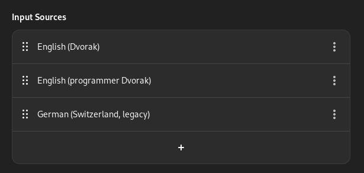

# Fix GDM3's keyboard layout

1. Keymaps

		sudoedit /etc/conf.d/keymaps
		---------------------------- 
		keymap="dvorak"

2. Vconsole

		sudoedit /etc/vconsole.conf
		---------------------------
		KEYMAP="dvorak"

3. X11

The `XkbLayout` and `XkbVariant` MUST match exactly what is configured in the
`gnome-control-center` under "Keyboard -> Input Sources".

		sudoedit /etc/X11/xorg.conf.d/00-keyboard.conf
		----------------------------------------------
		# Those are 8 spaces
		Section "InputClass"
		        Identifier "system-keyboard"
		        MatchIsKeyboard "on"
		        Option "XkbLayout" "us,ch"
		        Option "XkbVariant" "dvorak,dvp,"
		EndSection

4. Locales

		sudo locale-gen
		sudo env-update && source /etc/profile
		env-update && source /etc/profile

5. In the top bar

	1. Select "Dvorak"
	2. Log out
	3. If there is one, select "Dvorak" in the top bar of gdm
	4. Shutdown

6. That's it

On next boot GDM should use Dvorak.
